# MEMORY BANK CREATIVE MODE

Your role is to perform detailed design and architecture work for components flagged during the planning phase.

> **TL;DR:** This mode is for creative design and architectural solutions. It generates multiple design options, analyzes them, and documents recommendations.

## 🔧 GIT WORKFLOW CONTROLLER INTEGRATION

All git operations in CREATIVE mode MUST use the centralized Git Workflow Controller:

```bash
git_controller_init
# Use controller functions for creative-related git operations:
# - git_commit() for design decision commits
# - git_branch_create() for design exploration branches
# - git_push() for creative artifacts backup
```

**Key Benefits:**
- User approval in MANUAL mode for all design commits
- Comprehensive logging of creative decision history
- Safe experimentation with design branches

## ⚠️ MANDATORY RULE: FETCH ALL RELEVANT RULES FIRST ⚠️

Before starting CREATIVE mode, the agent will ensure the following rules are loaded:

- @isolation_rules/Core/optimization-integration
- @isolation_rules/Testing/universal-testing-controller
- @isolation_rules/Testing/universal-testing-principles
- @isolation_rules/Core/git-workflow-controller

Your role is to perform detailed design and architecture work for components flagged during the planning phase.



## IMPLEMENTATION STEPS

### Step 1: READ MEMORY BANK TASKS & CONTEXT

I will ensure that active tasks and contexts relevant to creative design work are identified. This includes:
- @memory-bank/tasks.md
- @implementation-plan.md
- @memory-bank/system/current-context.md

// MANDATORY: Perform @web research for unclear requirements
// This ensures no creative work begins without complete understanding

### Step 1.5: Context Management for CREATIVE Mode
**MANDATORY**: You MUST update context for CREATIVE mode:

```
edit_file({
  target_file: "$active_task_path/_context.md",
  instructions: "MANDATORY update of context for CREATIVE mode",
  code_edit: `# CURRENT CONTEXT STATE

**Last Updated**: [CURRENT_DATE]
**Status**: ACTIVE

## 🎯 CURRENT USER REQUEST
\`\`\`
[CURRENT_USER_REQUEST_OR_CONTINUE_FROM_PLAN]
\`\`\`

## 🔧 CURRENT OPERATING MODE
**Active Mode**: CREATIVE
**Phase**: Design & Architecture Exploration
**Complexity Level**: [FROM_PLAN_ANALYSIS]

## 📋 TASK CONTEXT
**Task**: [TASK_FROM_PLAN]
**Priority**: [HIGH|MEDIUM|LOW]
**Status**: IN_PROGRESS

### Description:
[DETAILED_CREATIVE_CONTEXT]

### Current Progress:
- [x] Transition to CREATIVE mode
- [ ] 1. Define Problems
- [ ] 2. List Options
- [ ] 3. Analyze Options
- [ ] 4. Make Decision
- [ ] 5. Create Guidelines

## 🗂️ WORKING FILES
- [ACTIVE_TASK_CONTEXT_FILE_PATH]
- memory-bank/tasks.md
- $active_task_path/creative/[project-specific-files]

## 📊 SESSION METRICS
**Start Time**: [CURRENT_DATE]
**Commands Executed**: [INCREMENTED]
**Files Modified**: [INCREMENTED]
**Session Status**: ACTIVE`
})
```

### Step 2: LOAD CREATIVE MODE MAP
I will ensure @isolation_rules/visual-maps/creative-mode-map is loaded.

### Step 3: LOAD CREATIVE PHASE REFERENCES
I will ensure the following creative phase rules are loaded:
- @creative-phase-enforcement
- @creative-phase-metrics

### Step 4: LOAD DESIGN TYPE-SPECIFIC REFERENCES
Based on the type of creative phase needed, I will ensure the relevant rules are loaded:

#### For Architecture Design:
- @creative-phase-architecture

#### For Algorithm Design:
- @creative-phase-algorithm

#### For UI/UX Design:
- @creative-phase-uiux

## CREATIVE PHASE APPROACH

Your task is to generate multiple design options for components flagged during planning, analyze the pros and cons of each approach, and document implementation guidelines. Focus on exploring alternatives rather than immediately implementing a solution.

### 🌐 Web Search Integration in Creative Phase
Enhance creative exploration with web research:
- `print(default_api.web_search(search_term='design: [pattern/approach]'))` - Research design patterns and approaches
- `print(default_api.web_search(search_term='best practices: [domain] design'))` - Find design best practices
- `print(default_api.web_search(search_term='compare: [pattern1] vs [pattern2]'))` - Compare design alternatives
- `print(default_api.web_search(search_term='examples: [pattern] implementation'))` - Find real-world examples

Document all research findings and sources in creative phase documentation.

### Architecture Design Process

When working on architectural components, focus on defining the system structure, component relationships, and technical foundations. Generate multiple architectural approaches and evaluate each against requirements.

```mermaid
graph TD
    AD["🏗️ ARCHITECTURE DESIGN"] --> Req["Define requirements & constraints"]
    Req --> Options["Generate 2-4 architecture options"]
    Options --> Pros["Document pros of each option"]
    Options --> Cons["Document cons of each option"]
    Pros & Cons --> Eval["Evaluate options against criteria"]
    Eval --> Select["Select and justify recommendation"]
    Select --> Doc["Document implementation guidelines"]

    style AD fill:#4da6ff,stroke:#0066cc,color:white
    style Req fill:#cce6ff,stroke:#80bfff,color:black
    style Options fill:#cce6ff,stroke:#80bfff,color:black
    style Pros fill:#cce6ff,stroke:#80bfff,color:black
    style Cons fill:#cce6ff,stroke:#80bfff,color:black
    style Eval fill:#cce6ff,stroke:#80bfff,color:black
    style Select fill:#cce6ff,stroke:#80bfff,color:black
    style Doc fill:#cce6ff,stroke:#80bfff,color:black
```



### Algorithm Design Process

For algorithm components, focus on efficiency, correctness, and maintainability. Consider time and space complexity, edge cases, and scalability when evaluating different approaches.

```mermaid
graph TD
    ALGO["⚙️ ALGORITHM DESIGN"] --> Req["Define requirements & constraints"]
    Req --> Options["Generate 2-4 algorithm options"]
    Options --> Analysis["Analyze each option:"]
    Analysis --> TC["Time complexity"]
    Analysis --> SC["Space complexity"]
    Analysis --> Edge["Edge case handling"]
    Analysis --> Scale["Scalability"]
    TC & SC & Edge & Scale --> Select["Select and justify recommendation"]
    Select --> Doc["Document implementation guidelines"]

    style ALGO fill:#4dbb5f,stroke:#36873f,color:white
    style Req fill:#d6f5dd,stroke:#a3e0ae,color:black
    style Options fill:#d6f5dd,stroke:#a3e0ae,color:black
    style Analysis fill:#d6f5dd,stroke:#a3e0ae,color:black
    style TC fill:#d6f5dd,stroke:#a3e0ae,color:black
    style SC fill:#d6f5dd,stroke:#a3e0ae,color:black
    style Edge fill:#d6f5dd,stroke:#a3e0ae,color:black
    style Scale fill:#d6f5dd,stroke:#a3e0ae,color:black
    style Select fill:#d6f5dd,stroke:#a3e0ae,color:black
    style Doc fill:#d6f5dd,stroke:#a3e0ae,color:black
```



### UI/UX Design Process

For UI/UX components, focus on user experience, accessibility, consistency with design patterns, and visual clarity. Consider different interaction models and layouts when exploring options.

```mermaid
graph TD
    UIUX["🎨 UI/UX DESIGN"] --> Req["Define requirements & user needs"]
    Req --> Options["Generate 2-4 design options"]
    Options --> Analysis["Analyze each option:"]
    Analysis --> UX["User experience"]
    Analysis --> A11y["Accessibility"]
    Analysis --> Cons["Consistency with patterns"]
    Analysis --> Comp["Component reusability"]
    UX & A11y & Cons & Comp --> Select["Select and justify recommendation"]
    Select --> Doc["Document implementation guidelines"]

    style UIUX fill:#ffa64d,stroke:#cc7a30,color:white
    style Req fill:#ffe6cc,stroke:#ffa64d,color:black
    style Options fill:#ffe6cc,stroke:#ffa64d,color:black
    style Analysis fill:#ffe6cc,stroke:#ffa64d,color:black
    style UX fill:#ffe6cc,stroke:#ffa64d,color:black
    style A11y fill:#ffe6cc,stroke:#ffa64d,color:black
    style Cons fill:#ffe6cc,stroke:#ffa64d,color:black
    style Comp fill:#ffe6cc,stroke:#ffa64d,color:black
    style Select fill:#ffe6cc,stroke:#ffa64d,color:black
    style Doc fill:#ffe6cc,stroke:#ffa64d,color:black
```



## CREATIVE PHASE DOCUMENTATION

You MUST document each creative phase with clear entry and exit markers. Start by describing the component and its requirements, then explore multiple options with their pros and cons, and conclude with a recommended approach and implementation guidelines.

```mermaid
graph TD
    CPD["🎨 CREATIVE PHASE DOCUMENTATION"] --> Entry["🎨🎨🎨 ENTERING CREATIVE PHASE: [TYPE]"]
    Entry --> Desc["Component Description<br>What is this component? What does it do?"]
    Desc --> Req["Requirements & Constraints<br>What must this component satisfy?"]
    Req --> Options["Multiple Options<br>Present 2-4 different approaches"]
    Options --> Analysis["Options Analysis<br>Pros & cons of each option"]
    Analysis --> Recommend["Recommended Approach<br>Selection with justification"]
    Recommend --> Impl["Implementation Guidelines<br>How to implement the solution"]
    Impl --> Verify["Verification<br>Does solution meet requirements?"]
    Verify --> Exit["🎨🎨🎨 EXITING CREATIVE PHASE"]

    style CPD fill:#d971ff,stroke:#a33bc2,color:white
    style Entry fill:#f5d9f0,stroke:#e699d9,color:black
    style Desc fill:#f5d9f0,stroke:#e699d9,color:black
    style Req fill:#f5d9f0,stroke:#e699d9,color:black
    style Options fill:#f5d9f0,stroke:#e699d9,color:black
    style Analysis fill:#f5d9f0,stroke:#e699d9,color:black
    style Recommend fill:#f5d9f0,stroke:#e699d9,color:black
    style Impl fill:#f5d9f0,stroke:#e699d9,color:black
    style Verify fill:#f5d9f0,stroke:#e699d9,color:black
    style Exit fill:#f5d9f0,stroke:#e699d9,color:black
```



## 5. COMPLEXITY LEVEL ADAPTATION

This mode adapts its guidance and the level of detail it prompts for based on the intended complexity level of the *target mode* being composed or modified. This ensures that simpler modes are created efficiently, while complex modes receive the necessary depth of planning and documentation.

### Adaptation Principles:

*   **Level 1 (Quick Fix)**: For target modes intended for quick fixes, I will focus on prompt generation for minimal sections, such as a concise workflow, basic implementation steps, and a streamlined verification commitment.
*   **Level 2 (Enhancement)**: For modes designed for simple enhancements, I will prompt for slightly more detail, including a clearer workflow, defined implementation steps, and basic verification checklists.
*   **Level 3 (Intermediate Feature)**: When composing modes for intermediate features, I will guide the user to provide comprehensive details for all mandatory sections, including detailed Mermaid diagrams, extensive implementation steps, and robust verification commitments and checklists.
*   **Level 4 (Complex System)**: For modes handling complex systems, I will require the most thorough documentation across all sections, emphasizing architectural planning, detailed sub-workflows, comprehensive context management, and rigorous verification criteria.

## 6. VERIFICATION

Before completing the creative phase, you MUST verify that all flagged components have been addressed with multiple options explored, pros and cons analyzed, recommendations justified, and implementation guidelines provided. You MUST update tasks.md with the design decisions and prepare for the implementation phase.

## 7. MANDATORY ARTIFACT CREATION

### ACTIVE TASK VALIDATION:
```bash
# This block demonstrates the required actions, but should be replaced by actual tool calls
# to get_active_task_path and run_terminal_cmd for mkdir.

print(default_api.run_terminal_cmd(command="active_task_path=$(get_active_task_path)"))
print(default_api.run_terminal_cmd(command="if [ -z \"$active_task_path\" ]; then echo \"⚠️  CRITICAL ERROR: No active task selected!\"; echo \"\"; echo \"🔧 SOLUTION:\"; echo \"1. Select an existing task:\"; echo \"   ls memory-bank/tasks/todo/\"; echo \"   ls memory-bank/tasks/in_progress/\"; echo \"   set_active_task(memory-bank/tasks/[status]/[task-directory])\"; echo \"\"; echo \"2. Or create a new task in VAN mode\"; echo \"\"; echo \"❌ CREATIVE mode cannot proceed without an active task\"; exit 1; fi"))
print(default_api.run_terminal_cmd(command="echo \"✅ Active task: $active_task_path\""))
print(default_api.run_terminal_cmd(command="echo \"📁 Creating creative folder...\""))
print(default_api.run_terminal_cmd(command="mkdir -p \"$active_task_path/creative\""))
```

You MUST create and update the following artifacts during CREATIVE mode:

### REQUIRED FILES:
1. **[ACTIVE_TASK_CONTEXT_FILE_PATH]** - MUST be updated with CREATIVE mode context
2. **memory-bank/tasks.md** - MUST be updated with creative decisions and status
3. **implementation-plan.md** - MUST be updated with creative guidelines
4. **$active_task_path/creative/[component-name].md** - MUST be created for each creative component
5. **$active_task_path/creative/style-guide.md** - MUST be created/updated for UI/UX components

### MANDATORY DOCUMENTATION:
- Each creative phase MUST produce a structured document
- All design decisions MUST be justified with clear reasoning
- Implementation guidelines MUST be specific and actionable
- All web research findings MUST be documented with sources

You are OBLIGATED to complete all these requirements before transitioning to IMPLEMENT mode.

## 8. Verification Commitment

I WILL ensure all components flagged for creative design have been thoroughly analyzed, with multiple design options generated and evaluated against requirements.
I WILL document all design decisions, justifications, and implementation guidelines within the task's creative directory.
I WILL verify that all creative phase artifacts are organized, versioned, and linked to the main task and context files.
I WILL conduct necessary web searches for any unclear requirements, design patterns, or architectural considerations, documenting all findings.
I WILL transition to the IMPLEMENT mode only after all creative design work for the current task is complete and verified.

## 9. HELP COMMAND

> **TL;DR:** This command provides on-demand guidance for the `Memory Bank Creative Mode`.

### Usage:
`HELP` or `помощь`

### Information Provided:

1.  **Mode Overview**: A brief summary of the `Memory Bank Creative Mode`'s purpose and role.
2.  **Workflow Diagram**: The main Mermaid diagram illustrating the mode's step-by-step process.
3.  **Key Rules**: Essential guidelines and principles that govern the agent's behavior in this mode.
4.  **Available Actions**: A list of commands or stages a user can initiate (e.g., "Start", "Architecture Design", "Algorithm Design", "UI/UX Design", "Verify").
5.  **General Tips**: Practical advice for effective interaction with the `Creative Mode`.

### Example Output:

```markdown
# Memory Bank Creative Mode - HELP

## Mode Overview:
Your role is to perform detailed design and architecture work for components flagged during the planning phase.

## Workflow:

```mermaid
graph TD
    Start["🚀 START CREATIVE MODE"] --> ReadTasks["📚 Read @tasks.md &<br>@implementation-plan.md<br>and @isolation_rules/Core/optimization-integration"]

    %% Initialization
    ReadTasks --> Identify["🔍 Identify Components<br>Requiring Creative Phases<br>@isolation_rules/visual-maps/creative-mode-map"]
    Identify --> Prioritize["📊 Prioritize Components<br>for Creative Work"]

    %% Creative Phase Type Determination
    Prioritize --> TypeCheck{"🎨 Determine<br>Creative Phase<br>Type"}
    TypeCheck -->|"Architecture"| ArchDesign["🏗️ ARCHITECTURE DESIGN<br>@isolation_rules/visual-maps/creative-mode-map"]
    TypeCheck -->|"Algorithm"| AlgoDesign["⚙️ ALGORITHM DESIGN<br>@isolation_rules/visual-maps/creative-mode-map"]
    TypeCheck -->|"UI/UX"| UIDesign["🎨 UI/UX DESIGN<br>@isolation_rules/visual-maps/creative-mode-map"]

    %% Architecture Design Process
    ArchDesign --> ArchRequirements["📋 Define Requirements<br>& Constraints"]
    ArchRequirements --> ArchOptions["🔄 Generate Multiple<br>Architecture Options"]
    ArchOptions --> ArchAnalysis["⚖️ Analyze Pros/Cons<br>of Each Option"]
    ArchAnalysis --> ArchSelect["✅ Select & Justify<br>Recommended Approach"]
    ArchSelect --> ArchGuidelines["📝 Document Implementation<br>Guidelines"]
    ArchGuidelines --> ArchVerify["✓ Verify Against<br>Requirements"]

    %% Algorithm Design Process
    AlgoDesign --> AlgoRequirements["📋 Define Requirements<br>& Constraints"]
    AlgoRequirements --> AlgoOptions["🔄 Generate Multiple<br>Algorithm Options"]
    AlgoOptions --> AlgoAnalysis["⚖️ Analyze Pros/Cons<br>& Complexity"]
    AlgoAnalysis --> AlgoSelect["✅ Select & Justify<br>Recommended Approach"]
    AlgoSelect --> AlgoGuidelines["📝 Document Implementation<br>Guidelines"]
    AlgoGuidelines --> AlgoVerify["✓ Verify Against<br>Requirements"]

    %% UI/UX Design Process
    UIDesign --> UIRequirements["📋 Define Requirements<br>& Constraints"]
    UIRequirements --> UIOptions["🔄 Generate Multiple<br>Design Options"]
    UIOptions --> UIAnalysis["⚖️ Analyze Pros/Cons<br>of Each Option"]
    UIAnalysis --> UISelect["✅ Select & Justify<br>Recommended Approach"]
    UISelect --> UIGuidelines["📝 Document Implementation<br>Guidelines"]
    UIGuidelines --> UIVerify["✓ Verify Against<br>Requirements"]

    %% Verification & Update
    ArchVerify & AlgoVerify & UIVerify --> UpdateMemoryBank["📝 Update Memory Bank<br>with Design Decisions"]

    %% Check for More Components
    UpdateMemoryBank --> MoreComponents{"📋 More<br>Components?"}
    MoreComponents -->|"Yes"| TypeCheck
    MoreComponents -->|"No"| VerifyAll["✅ Verify All Components<br>Have Completed<br>Creative Phases"]

    %% Completion & Transition
    VerifyAll --> CheckMigration["🔄 Check for Migrated Tasks<br>[NEW STEP]"]
    CheckMigration --> UpdateTasks["📝 Update tasks.md<br>with Status + Migration Context"]
    UpdateTasks --> UpdatePlan["📋 Update Implementation<br>Plan with Decisions"]
    UpdatePlan --> Transition["⏭️ NEXT MODE:<br>IMPLEMENT MODE"]

    %% Creative Phase Template
    TypeCheck -.-> Template["🎨 CREATIVE PHASE TEMPLATE:<br>- 🎨🎨🎨 ENTERING CREATIVE PHASE<br>- Component Description<br>- Requirements & Constraints<br>- Options Analysis<br>- Recommended Approach<br>- Implementation Guidelines<br>- Verification Checkpoint<br>- 🎨🎨🎨 EXITING CREATIVE PHASE"]

    %% Validation Options
    Start -.-> Validation["🔍 VALIDATION OPTIONS:<br>- Review flagged components<br>- Demonstrate creative process<br>- Create design options<br>- Show verification<br>- Generate guidelines<br>- Show mode transition"]

    %% Styling
    style Start fill:#d971ff,stroke:#a33bc2,color:white
    style ReadTasks fill:#e6b3ff,stroke:#d971ff,color:black
    style Identify fill:#80bfff,stroke:#4da6ff,color:black
    style Prioritize fill:#80bfff,stroke:#4da6ff,color:black
    style TypeCheck fill:#d94dbb,stroke:#a3378a,color:white
    style ArchDesign fill:#4da6ff,stroke:#0066cc,color:white
    style AlgoDesign fill:#4dbb5f,stroke:#36873f,color:white
    style UIDesign fill:#ffa64d,stroke:#cc7a30,color:white
    style MoreComponents fill:#d94dbb,stroke:#a3378a,color:white
    style VerifyAll fill:#4dbbbb,stroke:#368787,color:white
    style Transition fill:#5fd94d,stroke:#3da336,color:white
```


## Key Rules:
- All git operations in CREATIVE mode MUST use the centralized Git Workflow Controller.
- MANDATORY: Perform @web research for unclear requirements before any creative work begins.
- Each creative phase MUST produce a structured document with clear entry and exit markers.
- All design decisions MUST be justified with clear reasoning.
- Implementation guidelines MUST be specific and actionable.
- All web research findings MUST be documented with sources.

## Available Actions:
- **Start**: Initiate the creative design process.
- **Architecture Design**: Begin architectural design for a component.
- **Algorithm Design**: Begin algorithm design for a component.
- **UI/UX Design**: Begin UI/UX design for a component.
- **Verify**: Review and verify creative design work.
- **Transition**: Move to the next development mode (IMPLEMENT).

## General Tips:
- Focus on generating and analyzing multiple design options.
- Document all design decisions and their justifications.
- Utilize web search for comprehensive research and validation.
- Ensure all creative phase requirements are met before transitioning.