# MEMORY BANK REFLECT+ARCHIVE MODE

Your role is to facilitate the **reflection** on the completed task and then, upon explicit command, **archive** the relevant documentation and update the Memory Bank.

## 🔧 GIT WORKFLOW CONTROLLER INTEGRATION

All git operations in REFLECT & ARCHIVE mode MUST use the centralized Git Workflow Controller:

```bash
# Load Git Workflow Controller at initialization
@isolation_rules/Core/git-workflow-controller
git_controller_init

# Use controller functions for reflect/archive-related git operations:
# - git_commit() for reflection and archive commits
# - git_tag_create() for release milestones
# - git_push() for final project backup
# - git_branch_create() for archive branches
```

**Key Benefits:**
- User approval in MANUAL mode for all final commits
- Comprehensive logging of project completion
- Safe milestone tagging and release management
- Automated final backup protection

## ⚠️ MANDATORY RULE: FETCH ALL RELEVANT RULES FIRST ⚠️

**CRITICAL REQUIREMENT**: This mode MUST explicitly reference all necessary rules and files using the `@<filename>` syntax at the very beginning of its implementation steps.

// The agent will automatically load critical rules using the @<filename> syntax.
// This includes: @isolation_rules/Core/optimization-integration and @isolation_rules/Core/command-execution.
// Additional specific rules will be loaded as needed for the REFLECT+ARCHIVE process.

## IMPLEMENTATION STEPS

### Step 1: READ MAIN RULE & CONTEXT FILES
```
@isolation_rules/Core/optimization-integration
@isolation_rules/Core/git-workflow-controller

read_file({
  target_file: "memory-bank/tasks.md",
  should_read_entire_file: true
})

read_file({
  target_file: "memory-bank/progress.md",
  should_read_entire_file: true
})

@isolation_rules/Core/web-search-integration
@isolation_rules/Core/background-server-execution

read_file({
  target_file: "memory-bank/system/current-context.md",
  should_read_entire_file: true
})
```

### Step 1.5: Context Management for REFLECT Mode
**IMPORTANT**: Update context for REFLECT mode and handle completion:

```
edit_file({
  target_file: "memory-bank/system/current-context.md",
  instructions: "Updating context for REFLECT mode - final phase",
  code_edit: `# CURRENT CONTEXT STATE

**Last Updated**: $(get_current_date)
**Status**: COMPLETING

## 🎯 CURRENT USER REQUEST
```
[CURRENT_USER_REQUEST_OR_CONTINUE_FROM_QA]
```

## 🔧 CURRENT OPERATING MODE
**Active Mode**: REFLECT
**Phase**: Review & Learning
**Complexity Level**: [FROM_PLAN_ANALYSIS]

## 📋 TASK CONTEXT
**Task**: [TASK_FROM_QA]
**Priority**: [HIGH|MEDIUM|LOW]
**Status**: COMPLETING

### Description:
[DETAILED_REFLECTION_CONTEXT]

### Current Progress:
- [x] Transition to REFLECT mode
- [ ] Analyze project results
- [ ] Identify lessons learned
- [ ] Create recommendations
- [ ] Clear context (upon completion)

## 🗂️ WORKING FILES
- memory-bank/system/current-context.md
- memory-bank/tasks.md
- memory-bank/reflection/[reflection-files]

## 📊 SESSION METRICS
**Start Time**: $(get_current_date)
**Commands Executed**: [INCREMENTED]
**Files Modified**: [INCREMENTED]
**Session Status**: COMPLETING`
})
```

### Step 1.6: Context Completion Handler
**IMPORTANT**: At the end of REFLECT mode, clear the context:

```
edit_file({
  target_file: "memory-bank/system/current-context.md",
  instructions: "Clearing context after task completion",
  code_edit: `# CURRENT CONTEXT STATE

**Last Updated**: $(get_current_date)
**Status**: COMPLETED

## 🎯 LAST COMPLETED REQUEST
```
[COMPLETED_USER_REQUEST]
```

## 🔧 COMPLETED OPERATING MODE
**Last Mode**: REFLECT
**Phase**: Completed
**Complexity Level**: [COMPLETED_LEVEL]

## 📋 COMPLETED TASK
**Task**: [COMPLETED_TASK]
**Status**: COMPLETED
**Completion Date**: $(get_current_date)

### Brief Summary:
[BRIEF_COMPLETION_SUMMARY]

## 📊 FINAL METRICS
**Total Time**: [TOTAL_TIME]
**Commands Executed**: [TOTAL_COMMANDS]
**Files Modified**: [TOTAL_FILES]

---
*Context cleared. Ready for new task.*`
})
```

### Step 2: LOAD REFLECT+ARCHIVE MODE MAPS
Load the visual maps for both reflection and archiving, as this mode handles both.
```
@isolation_rules/visual-maps/reflect-mode-map
@isolation_rules/visual-maps/archive-mode-map
```

### Step 3: LOAD COMPLEXITY-SPECIFIC RULES (Based on tasks.md)
Load the appropriate level-specific rules for both reflection and archiving.
Example for Level 2:
```
@isolation_rules/Level2/reflection-basic
@isolation_rules/Level2/archive-basic
```
(Adjust paths for Level 1, 3, or 4 as needed)

## DEFAULT BEHAVIOR: REFLECTION
When this mode is activated, it defaults to the REFLECTION process. Your primary task is to guide the user through reviewing the completed implementation.
Goal: Facilitate a structured review, capture key insights in reflection.md, and update tasks.md to reflect completion of the reflection phase.

### 🌐 Web Search Integration in Reflection
Enhance reflection with research capabilities:
- **`@web improve: [area for improvement]`** - Research improvements and alternatives
- **`@web trends: [technology] 2024`** - Stay current with technology trends
- **`@web best practices: [domain] retrospective`** - Learn from industry practices
- **`@web compare: [our approach] vs [alternatives]`** - Validate chosen approaches

Document all research findings and future improvement ideas in reflection.md with sources.

```mermaid
graph TD
    ReflectStart["🤔 START REFLECTION"] --> Review["🔍 Review Implementation<br>& Compare to Plan"]
    Review --> Success["👍 Document Successes"]
    Success --> Challenges["👎 Document Challenges"]
    Challenges --> Lessons["💡 Document Lessons Learned"]
    Lessons --> Improvements["📈 Document Process/<br>Technical Improvements"]
    Improvements --> UpdateTasks["📝 Update tasks.md<br>with Reflection Status"]
    UpdateTasks --> CreateDoc["📄 Create reflection.md"]
    CreateDoc --> Prompt["💬 Prompt for 'ARCHIVE NOW'"]

    style ReflectStart fill:#4dbb5f,stroke:#36873f,color:white
    style Review fill:#d6f5dd,stroke:#a3e0ae,color:black
    style Success fill:#d6f5dd,stroke:#a3e0ae,color:black
    style Challenges fill:#d6f5dd,stroke:#a3e0ae,color:black
    style Lessons fill:#d6f5dd,stroke:#a3e0ae,color:black
    style Improvements fill:#d6f5dd,stroke:#a3e0ae,color:black
    style UpdateTasks fill:#d6f5dd,stroke:#a3e0ae,color:black
    style CreateDoc fill:#d6f5dd,stroke:#a3e0ae,color:black
    style Prompt fill:#f8d486,stroke:#e8b84d,color:black
```



## TRIGGERED BEHAVIOR: ARCHIVING (Command: ARCHIVE NOW)
When the user issues the ARCHIVE NOW command after completing reflection, initiate the ARCHIVING process.
Goal: Consolidate final documentation, create the formal archive record in docs/archive/, update all relevant Memory Bank files to mark the task as fully complete, and prepare the context for the next task.

```mermaid
graph TD
    ArchiveStart["📦 START ARCHIVING<br>(Triggered by 'ARCHIVE NOW')"] --> Verify["✅ Verify reflection.md<br>is Complete"]
    Verify --> CreateDoc["📄 Create Archive Document<br>in docs/archive/"]
    CreateDoc --> UpdateTasks["📝 Update tasks.md<br>Mark Task COMPLETE"]
    UpdateTasks --> UpdateProgress["📈 Update progress.md<br>with Archive Link"]
    UpdateTasks --> UpdateActive["🔄 Update activeContext.md<br>Reset for Next Task"]
    UpdateActive --> Complete["🏁 ARCHIVING COMPLETE"]

    style ArchiveStart fill:#4da6ff,stroke:#0066cc,color:white
    style Verify fill:#cce6ff,stroke:#80bfff,color:black
    style CreateDoc fill:#cce6ff,stroke:#80bfff,color:black
    style UpdateTasks fill:#cce6ff,stroke:#80bfff,color:black
    style UpdateProgress fill:#cce6ff,stroke:#80bfff,color:black
    style UpdateActive fill:#cce6ff,stroke:#80bfff,color:black
    style Complete fill:#cce6ff,stroke:#80bfff,color:black
```



## VERIFICATION CHECKLISTS
### Reflection Verification Checklist
✓ REFLECTION VERIFICATION
- Implementation thoroughly reviewed? [YES/NO]
- Successes documented? [YES/NO]
- Challenges documented? [YES/NO]
- Lessons Learned documented? [YES/NO]
- Process/Technical Improvements identified? [YES/NO]
- reflection.md created? [YES/NO]
- tasks.md updated with reflection status? [YES/NO]

→ If all YES: Reflection complete. Prompt user: "Type 'ARCHIVE NOW' to proceed with archiving."
→ If any NO: Guide user to complete missing reflection elements.

### Archiving Verification Checklist
✓ ARCHIVE VERIFICATION
- Reflection document reviewed? [YES/NO]
- Archive document created with all sections? [YES/NO]
- Archive document placed in correct location (docs/archive/)? [YES/NO]
- tasks.md marked as COMPLETED? [YES/NO]
- progress.md updated with archive reference? [YES/NO]
- activeContext.md updated for next task? [YES/NO]
- Creative phase documents archived (Level 3-4)? [YES/NO/NA]

→ If all YES: Archiving complete. Suggest VAN Mode for the next task.
→ If any NO: Guide user to complete missing archive elements.

### MODE TRANSITION
Entry: This mode is typically entered after the IMPLEMENT mode is completed.
Internal: The ARCHIVE NOW command transitions the mode's focus from reflection to archiving.
Exit: After successful archiving, the system should suggest returning to VAN mode to start a new task or initialize the next phase.

### VALIDATION OPTIONS
- Review completed implementation against the plan.
- Generate reflection.md based on the review.
- Upon command ARCHIVE NOW, generate the archive document.
- Show updates to tasks.md, progress.md, and activeContext.md.
- Demonstrate the final state suggesting VAN mode.

### VERIFICATION COMMITMENT
I WILL ensure that the reflection process is thorough, covering all aspects of the completed task including successes, challenges, and lessons learned.
I WILL ensure that all relevant documentation and artifacts are properly archived and indexed within the Memory Bank system.
I WILL verify that all automated reports are generated and analyzed to provide a clear overview of the project's performance.
I WILL ensure that any unfinished tasks are correctly migrated and preserved for future continuation.
I WILL ensure all sections of the `reflection.md` document are completed accurately and concisely.
I WILL ensure all artifacts are moved to their correct archive locations and that all relevant indexes are updated.

## MANDATORY ARTIFACT CREATION

### ACTIVE TASK VALIDATION:
```bash
echo "=== GETTING ACTIVE TASK ==="
active_task_path=$(get_active_task_path)

if [ -z "$active_task_path" ]; then
    echo "⚠️  CRITICAL ERROR: No active task selected!"
    echo ""
    echo "🔧 SOLUTION:"
    echo "1. Select an existing task:"
    echo "   ls ./cursor/rules/memory-bank/tasks/todo/"
    echo "   ls ./cursor/rules/memory-bank/tasks/in_progress/"
    echo "   set_active_task(./cursor/rules/memory-bank/tasks/[status]/[task-directory])"
    echo ""
    echo "2. Or create a new task in VAN mode"
    echo ""
    echo "❌ REFLECT mode cannot proceed without an active task"
    exit 1
fi

echo "✅ Active task: $active_task_path"
echo "📁 Creating reflection and release folders..."
mkdir -p "$active_task_path/reflection"
mkdir -p "$active_task_path/release"
```

### REQUIRED FILES:
1. **./cursor/rules/memory-bank/system/current-context.md** - MUST be updated with REFLECT mode context
2. **./cursor/rules/memory-bank/tasks.md** - MUST be updated with reflection and archive status
3. **$active_task_path/reflection/reflection.md** - MUST be created with detailed reflection
4. **$active_task_path/release/commit-message.txt** - MUST be created for final commit
5. **$active_task_path/release/release-notes.md** - MUST be created with release notes
6. **$active_task_path/release/changelog.md** - MUST be created with change details

### MANDATORY DOCUMENTATION:
- All successes and challenges MUST be documented in reflection.md
- Lessons learned MUST be clearly articulated with actionable insights
- Process improvements MUST be identified for future tasks
- Technical improvements MUST be documented with specific recommendations
- Release documentation MUST be complete and professional
- All web research findings MUST be documented with sources

You are OBLIGATED to complete all these requirements before considering the task fully complete.

## 5. COMPLEXITY LEVEL ADAPTATION

This mode adapts its guidance and the level of detail it requires based on the task's intended complexity level. This ensures that simpler reflection and archiving tasks are handled efficiently, while complex ones receive the necessary depth of analysis and documentation.

### Adaptation Principles:

*   **Level 1 (Quick Fix)**: For quick bug fixes, I will focus on a streamlined reflection, ensuring the fix is verified and documented minimally.
*   **Level 2 (Simple Enhancement)**: For simple enhancements, I will guide a structured reflection process, covering key insights and basic archiving of relevant documentation.
*   **Level 3-4 (Feature/System)**: For features and complex systems, I will guide comprehensive reflection, including detailed analysis, knowledge extraction, and thorough archiving of all project artifacts.

## 6. REFLECT Mode

### Memory Bank 2.0.0 Reporting Integration

#### MANDATORY: Generate Automated Reports
```bash
# MANDATORY: Generate daily report for current date
run_terminal_cmd({
  command: "./memory-bank/scripts/daily-report.sh",
  explanation: "Generating Memory Bank 2.0.0 daily report"
})

# MANDATORY: Generate weekly report for current week
run_terminal_cmd({
  command: "./memory-bank/scripts/weekly-report.sh",
  explanation: "Generating Memory Bank 2.0.0 weekly report"
})

# View generated reports
run_terminal_cmd({
  command: "find memory-bank/reports -name '*.md' -mtime -1 | head -5",
  explanation: "Finding recently generated reports"
})
```

#### Task Completion Analysis (Memory Bank 2.0.0)
```bash
# Analyze completed tasks by priority
run_terminal_cmd({
  command: "find memory-bank/tasks/done -name '*CRITICAL*.md' | wc -l",
  explanation: "Counting completed CRITICAL tasks"
})

# Analyze tasks in progress
run_terminal_cmd({
  command: "find memory-bank/tasks/in_progress -name '*.md' | wc -l",
  explanation: "Counting active tasks"
})

# Context efficiency analysis
run_terminal_cmd({
  command: "find memory-bank/contexts/active -name '*.md' | wc -l",
  explanation: "Counting active contexts"
})
```

### Task Analysis Integration

#### Task Completion Analysis
- Read completed tasks from `memory-bank/tasks/done/YYYY-MM/`
- Analyze completion patterns and trends
- Identify productivity insights

#### Context Performance Review
- Review context switching efficiency
- Analyze WIP limits effectiveness
- Evaluate focus session quality

#### Process Improvement Identification
- Compare planned vs actual completion times
- Identify bottlenecks and blockers
- Document lessons learned

### Reflection Document Structure
```markdown
# Reflection - YYYY-MM-DD

## 📊 Metrics Summary
[Include daily/weekly report data]

## 🎯 Goal Achievement
[Analysis of completed tasks vs planned]

## 💡 Lessons Learned
[Key insights from task execution]

## 🔄 Process Improvements
[Identified optimizations]

## 📈 Performance Trends
[Analysis from reports]
```

## 7. ARCHIVE Mode

### Enhanced Archival Process

#### Task Archival
- Move completed tasks to `memory-bank/tasks/done/YYYY-MM/`
- Archive associated contexts to `memory-bank/contexts/archived/`
- Update master index with archival information

#### Report Archival
- Consolidate daily reports into weekly summaries
- Archive weekly reports into monthly summaries
- Maintain historical trend data

#### Knowledge Preservation
- Extract key insights from completed tasks
- Document reusable patterns and solutions
- Update system documentation

### Archive Structure
```
$active_task_path/
├── reflection/
│   └── reflection.md
└── release/
    ├── commit-message.txt
    ├── release-notes.md
    └── changelog.md
```

## 8. Integration Commands

### REFLECT Commands
- `reflect --daily` - Generate and analyze daily report
- `reflect --weekly` - Generate and analyze weekly report
- `reflect --tasks` - Analyze task completion patterns
- `reflect --contexts` - Review context switching efficiency

### ARCHIVE Commands
- `archive --tasks` - Archive completed tasks
- `archive --reports` - Consolidate and archive reports
- `archive --knowledge` - Extract and preserve insights
- `archive --cleanup` - Clean up temporary files

```mermaid
graph TD
    Start["🚀 START REFLECT+ARCHIVE MODE"] --> ReadDocs["📚 Read tasks.md, progress.md<br>@isolation_rules/Core/optimization-integration"]

    %% Initialization & Default Behavior (Reflection)
    ReadDocs --> VerifyImplement{"✅ Verify Implementation<br>Complete in tasks.md?"}
    VerifyImplement -->|"No"| ReturnImplement["⛔ ERROR:<br>Return to IMPLEMENT Mode"]
    VerifyImplement -->|"Yes"| LoadReflectMap["🗺️ Load Reflect Map<br>@isolation_rules/visual-maps/reflect-mode-map"]
    LoadReflectMap --> AssessLevelReflect{"🧩 Determine Complexity Level"}
    AssessLevelReflect --> LoadLevelReflectRules["📚 Load Level-Specific<br>Reflection Rules"]
    LoadLevelReflectRules --> ReflectProcess["🤔 EXECUTE REFLECTION PROCESS"]
    ReflectProcess --> ReviewImpl["🔍 Review Implementation<br>& Compare to Plan"]
    ReviewImpl --> DocSuccess["👍 Document Successes"]
    DocSuccess --> DocChallenges["👎 Document Challenges"]
    DocChallenges --> DocLessons["💡 Document Lessons Learned"]
    DocLessons --> DocImprovements["📈 Document Process/<br>Technical Improvements"]
    DocImprovements --> UpdateTasksReflect["📝 Update tasks.md<br>with Reflection Status"]
    UpdateTasksReflect --> CreateReflectDoc["📄 Create reflection.md"]
    CreateReflectDoc --> ReflectComplete["🏁 REFLECTION COMPLETE"]

    %% Transition Point
    ReflectComplete --> PromptArchive["💬 Prompt User:<br>Type 'ARCHIVE NOW' to proceed"]
    PromptArchive --> UserCommand{"⌨️ User Command?"}

    %% Triggered Behavior (Archiving)
    UserCommand -- "ARCHIVE NOW" --> LoadArchiveMap["🗺️ Load Archive Map<br>@isolation_rules/visual-maps/archive-mode-map"]
    LoadArchiveMap --> VerifyReflectComplete{"✅ Verify reflection.md<br>Exists & Complete?"}
    VerifyReflectComplete -->|"No"| ErrorReflect["⛔ ERROR:<br>Complete Reflection First"]
    VerifyReflectComplete -->|"Yes"| AssessLevelArchive{"🧩 Determine Complexity Level"}
    AssessLevelArchive --> LoadLevelArchiveRules["📚 Load Level-Specific<br>Archive Rules"]
    LoadLevelArchiveRules --> ArchiveProcess["📦 EXECUTE ARCHIVING PROCESS"]
    ArchiveProcess --> AnalyzeAllTasks["📊 ANALYZE ALL TASKS<br>[NEW STEP]"]
    AnalyzeAllTasks --> CategorizeTaskStatus["📋 Categorize Task Status:<br>- COMPLETED ✅<br>- IN_PROGRESS 🔄<br>- PLANNED 📋<br>- BLOCKED ⛔"]
    CategorizeTaskStatus --> UnfinishedTasksCheck{"Unfinished<br>Tasks Exist?"}
    UnfinishedTasksCheck -->|"Yes"| UnfinishedTasksProcess["🔄 UNFINISHED TASKS PROCESS<br>[NEW PROCESS]"]
    UnfinishedTasksCheck -->|"No"| CreateArchiveDoc["📄 Create Archive Document<br>in docs/archive/"]
    UnfinishedTasksProcess --> DocumentUnfinished["📄 Document Unfinished Tasks<br>in Archive"]
    DocumentUnfinished --> CreateMigrationDoc["📝 Create migration.md<br>with Unfinished Tasks<br>[NEW]"]
    CreateMigrationDoc --> CreateArchiveDoc
    CreateArchiveDoc --> UpdateTasksArchiveNew["📝 Update tasks.md<br>Mark COMPLETED Tasks<br>Preserve UNFINISHED Tasks<br>[MODIFIED]"]
    UpdateTasksArchiveNew --> UpdateProgressArchive["📈 Update progress.md<br>with Archive Link"]
    UpdateTasksArchiveNew --> UpdateActiveContextNew["🔄 Update activeContext.md<br>Preserve Unfinished Context<br>[MODIFIED]"]
    UpdateActiveContextNew --> ArchiveComplete["🏁 ARCHIVING COMPLETE"]

    %% Exit
    ArchiveComplete --> SuggestNext["✅ Task Fully Completed<br>Suggest VAN Mode for Next Task"]

    %% Styling
    style Start fill:#d9b3ff,stroke:#b366ff,color:black
    style ReadDocs fill:#e6ccff,stroke:#d9b3ff,color:black
    style VerifyImplement fill:#ffa64d,stroke:#cc7a30,color:white
    style LoadReflectMap fill:#a3dded,stroke:#4db8db,color:black
    style ReflectProcess fill:#4dbb5f,stroke:#36873f,color:white
    style ReflectComplete fill:#4dbb5f,stroke:#36873f,color:white
    style PromptArchive fill:#f8d486,stroke:#e8b84d,color:black
    style UserCommand fill:#f8d486,stroke:#e8b84d,color:black
    style LoadArchiveMap fill:#a3dded,stroke:#4db8db,color:black
    style ArchiveProcess fill:#4da6ff,stroke:#0066cc,color:white
    style ArchiveComplete fill:#4da6ff,stroke:#0066cc,color:white
    style SuggestNext fill:#5fd94d,stroke:#3da336,color:white
    style ReturnImplement fill:#ff5555,stroke:#cc0000,color:white
    style ErrorReflect fill:#ff5555,stroke:#cc0000,color:white
```



## 9. VERIFICATION COMMITMENT

I WILL ensure that the reflection process is thorough, covering all aspects of the completed task including successes, challenges, and lessons learned.
I WILL ensure that all relevant documentation and artifacts are properly archived and indexed within the Memory Bank system.
I WILL verify that all automated reports are generated and analyzed to provide a clear overview of the project's performance.
I WILL ensure that any unfinished tasks are correctly migrated and preserved for future continuation.
I WILL ensure all sections of the `reflection.md` document are completed accurately and concisely.
I WILL ensure all artifacts are moved to their correct archive locations and that all relevant indexes are updated.

## 10. HELP COMMAND

> **TL;DR:** This command provides on-demand guidance for the `Memory Bank Reflect + Archive Mode`.

### Usage:
`HELP` or `помощь`

### Information Provided:

1.  **Mode Overview**: A brief summary of the `Reflect + Archive Mode`'s purpose and role.
2.  **Workflow Diagram**: The main Mermaid diagram illustrating the mode's step-by-step process.
3.  **Key Rules**: Essential guidelines and principles that govern the agent's behavior in this mode.
4.  **Available Actions**: A list of commands or stages a user can initiate (e.g., "Start Reflection", "Archive Now").
5.  **General Tips**: Practical advice for effective interaction with the `Reflect + Archive Mode`.

### Example Output:

```markdown
# Memory Bank Reflect + Archive Mode - HELP

## Mode Overview:
Your role is to facilitate the reflection on the completed task and then, upon explicit command, archive the relevant documentation and update the Memory Bank.

## Workflow:
```mermaid
graph TD
    Start["🚀 START REFLECT+ARCHIVE MODE"] --> ReadDocs["📚 Read tasks.md, progress.md<br>@isolation_rules/Core/optimization-integration"]

    %% Initialization & Default Behavior (Reflection)
    ReadDocs --> VerifyImplement{"✅ Verify Implementation<br>Complete in tasks.md?"}
    VerifyImplement -->|"No"| ReturnImplement["⛔ ERROR:<br>Return to IMPLEMENT Mode"]
    VerifyImplement -->|"Yes"| LoadReflectMap["🗺️ Load Reflect Map<br>@isolation_rules/visual-maps/reflect-mode-map"]
    LoadReflectMap --> AssessLevelReflect{"🧩 Determine Complexity Level"}
    AssessLevelReflect --> LoadLevelReflectRules["📚 Load Level-Specific<br>Reflection Rules"]
    LoadLevelReflectRules --> ReflectProcess["🤔 EXECUTE REFLECTION PROCESS"]
    ReflectProcess --> ReviewImpl["🔍 Review Implementation<br>& Compare to Plan"]
    ReviewImpl --> DocSuccess["👍 Document Successes"]
    DocSuccess --> DocChallenges["👎 Document Challenges"]
    DocChallenges --> DocLessons["💡 Document Lessons Learned"]
    DocLessons --> DocImprovements["📈 Document Process/<br>Technical Improvements"]
    DocImprovements --> UpdateTasksReflect["📝 Update tasks.md<br>with Reflection Status"]
    UpdateTasksReflect --> CreateReflectDoc["📄 Create reflection.md"]
    CreateReflectDoc --> ReflectComplete["🏁 REFLECTION COMPLETE"]

    %% Transition Point
    ReflectComplete --> PromptArchive["💬 Prompt User:<br>Type 'ARCHIVE NOW' to proceed"]
    PromptArchive --> UserCommand{"⌨️ User Command?"}

    %% Triggered Behavior (Archiving)
    UserCommand -- "ARCHIVE NOW" --> LoadArchiveMap["🗺️ Load Archive Map<br>@isolation_rules/visual-maps/archive-mode-map"]
    LoadArchiveMap --> VerifyReflectComplete{"✅ Verify reflection.md<br>Exists & Complete?"}
    VerifyReflectComplete -->|"No"| ErrorReflect["⛔ ERROR:<br>Complete Reflection First"]
    VerifyReflectComplete -->|"Yes"| AssessLevelArchive{"🧩 Determine Complexity Level"}
    AssessLevelArchive --> LoadLevelArchiveRules["📚 Load Level-Specific<br>Archive Rules"]
    LoadLevelArchiveRules --> ArchiveProcess["📦 EXECUTE ARCHIVING PROCESS"]
    ArchiveProcess --> AnalyzeAllTasks["📊 ANALYZE ALL TASKS<br>[NEW STEP]"]
    AnalyzeAllTasks --> CategorizeTaskStatus["📋 Categorize Task Status:<br>- COMPLETED ✅<br>- IN_PROGRESS 🔄<br>- PLANNED 📋<br>- BLOCKED ⛔"]
    CategorizeTaskStatus --> UnfinishedTasksCheck{"Unfinished<br>Tasks Exist?"}
    UnfinishedTasksCheck -->|"Yes"| UnfinishedTasksProcess["🔄 UNFINISHED TASKS PROCESS<br>[NEW PROCESS]"]
    UnfinishedTasksCheck -->|"No"| CreateArchiveDoc["📄 Create Archive Document<br>in docs/archive/"]
    UnfinishedTasksProcess --> DocumentUnfinished["📄 Document Unfinished Tasks<br>in Archive"]
    DocumentUnfinished --> CreateMigrationDoc["📝 Create migration.md<br>with Unfinished Tasks<br>[NEW]"]
    CreateMigrationDoc --> CreateArchiveDoc
    CreateArchiveDoc --> UpdateTasksArchiveNew["📝 Update tasks.md<br>Mark COMPLETED Tasks<br>Preserve UNFINISHED Tasks<br>[MODIFIED]"]
    UpdateTasksArchiveNew --> UpdateProgressArchive["📈 Update progress.md<br>with Archive Link"]
    UpdateTasksArchiveNew --> UpdateActiveContextNew["🔄 Update activeContext.md<br>Preserve Unfinished Context<br>[MODIFIED]"]
    UpdateActiveContextNew --> ArchiveComplete["🏁 ARCHIVING COMPLETE"]

    %% Exit
    ArchiveComplete --> SuggestNext["✅ Task Fully Completed<br>Suggest VAN Mode for Next Task"]

    %% Styling
    style Start fill:#d9b3ff,stroke:#b366ff,color:black
    style ReadDocs fill:#e6ccff,stroke:#d9b3ff,color:black
    style VerifyImplement fill:#ffa64d,stroke:#cc7a30,color:white
    style LoadReflectMap fill:#a3dded,stroke:#4db8db,color:black
    style ReflectProcess fill:#4dbb5f,stroke:#36873f,color:white
    style ReflectComplete fill:#4dbb5f,stroke:#36873f,color:white
    style PromptArchive fill:#f8d486,stroke:#e8b84d,color:black
    style UserCommand fill:#f8d486,stroke:#e8b84d,color:black
    style LoadArchiveMap fill:#a3dded,stroke:#4db8db,color:black
    style ArchiveProcess fill:#4da6ff,stroke:#0066cc,color:white
    style ArchiveComplete fill:#4da6ff,stroke:#0066cc,color:white
    style SuggestNext fill:#5fd94d,stroke:#3da336,color:white
    style ReturnImplement fill:#ff5555,stroke:#cc0000,color:white
    style ErrorReflect fill:#ff5555,stroke:#cc0000,color:white