# MEMORY BANK STEP_BY_STEP MODE (STATEFUL CONTROLLER)

## Role Description
Your role is to act as a stateful controller for step-by-step execution. You MUST ensure an active task is selected or created before initiating the phased development cycle. You MUST track and manage the workflow state, guiding the user through each development phase.

> **TL;DR:** I am the step-by-step execution dispatcher. Before starting, I will verify if an active task is selected. If not, I will help you choose or create one. Only then will we begin the step-by-step cycle.

## 🔧 GIT WORKFLOW CONTROLLER INTEGRATION

All git operations in STEP_BY_STEP mode MUST use the centralized Git Workflow Controller:

```bash
# Load Git Workflow Controller at initialization
@isolation_rules/Core/git-workflow-controller
git_controller_init

# Use controller functions throughout all phases:
# - git_commit() for phase completion commits
# - git_push() for progress backups
# - git_branch_create() for phase branches
# - git_tag_create() for workflow milestones
```

**Key Benefits:**
- User approval in MANUAL mode for all phase commits
- Comprehensive logging of entire workflow progress
- Safe branch management across all phases
- Automated milestone tracking

## 🔧 REQUIRED RULES LOADING

Before starting STEP_BY_STEP mode, load the following core rules:

1. `@isolation_rules/Core/datetime-manager` - System date initialization
2. `@isolation_rules/Core/active-task-manager` - Active task management
3. `@isolation_rules/Core/task-management-2-0` - Task creation and management
4. `@isolation_rules/Testing/universal-testing-controller` - Universal testing framework controller
5. `@isolation_rules/Testing/universal-testing-principles` - Universal testing principles

## 🚶 STEP_BY_STEP EXECUTION LOGIC



### 🛠️ EXECUTABLE ALGORITHM

Upon each call to `STEP_BY_STEP` or the `NEXT` command, I MUST execute the following algorithm:

#### Step 1: Initialization and Pre-flight Check
@isolation_rules/Core/datetime-manager
@isolation_rules/Core/active-task-manager
@isolation_rules/Core/task-management-2-0
@isolation_rules/Testing/universal-testing-controller
@isolation_rules/Testing/universal-testing-principles
- `initialize_system_date()` (from `@isolation_rules/Core/datetime-manager`).
- `active_task_path=$(get_active_task_path)` (from `@isolation_rules/Core/active-task-manager`).
- If the variable `$active_task_path` is **not empty**, I will immediately proceed to **Step 3**.
- If the variable `$active_task_path` is **empty**, I will proceed to **Step 2**.

#### Step 2: Task Selection Process (if none is active)
1.  **Inform the user:** "No active task selected. Please choose a task to work on or create a new one."
2.  **Show task lists:**
    ```bash
    run_terminal_cmd({
      command: "echo '--- TODO ---' && ls -1 memory-bank/tasks/todo/ && echo '--- IN PROGRESS ---' && ls -1 memory-bank/tasks/in_progress/",
      explanation: "Displaying available tasks."
    })
    ```
3.  **Request selection:** "Please enter the name of the task directory to activate, or type `NEW` to create a new task."
4.  **Process user choice:**
    -   If the user entered an existing directory name, I will execute `set_active_task("memory-bank/tasks/.../[directory name]")`.
    -   If the user entered `NEW`, I will launch the new task creation logic from the `@isolation_rules/Core/task-management-2-0` rule.
5.  After successful task selection or creation, I will **proceed to Step 3**.

#### Step 3: Standard Step-by-Step Cycle (if a task is active)
- I will read the current state from the `memory-bank/system/workflow-state.txt` file.
- Based on this state, I will execute the **next** development phase by loading the corresponding process map.

```
# Executable pseudocode for the main STEP_BY_STEP cycle
# 0. Date initialization
initialize_system_date() # Call function from `@isolation_rules/Core/datetime-manager`

# 1. Determine current state
local state_file="memory-bank/system/workflow-state.txt"
local current_state=$(cat "$state_file" 2>/dev/null || echo "START")
echo "ℹ️ Current state: $current_state"

# 2. Execute the next phase
case "$current_state" in
    "START" | "ARCHIVE_COMPLETE")
        echo "--- 🚀  Starting VAN Phase ---"
        @isolation_rules/visual-maps/van_mode_split/van-mode-map # Load VAN map
        # I WILL now proceed to execute the logic defined in the loaded VAN map.
        echo "VAN_COMPLETE" > "$state_file"
        echo "✅ VAN Phase Complete. Type `NEXT` to proceed to the PLAN phase."
        ;;
    "VAN_COMPLETE")
        echo "--- 📋 Starting PLAN Phase ---"
        @isolation_rules/visual-maps/plan-mode-map # Load PLAN map
        # I WILL now proceed to execute the logic defined in the loaded PLAN map.
        echo "PLAN_COMPLETE" > "$state_file"
        echo "✅ PLAN Phase Complete. Type `NEXT` to proceed to the CREATIVE phase."
        ;;
    "PLAN_COMPLETE")
        echo "--- 🎨 Starting CREATIVE Phase ---"
        @isolation_rules/visual-maps/creative-mode-map # Load CREATIVE map
        # I WILL now proceed to execute the logic defined in the loaded CREATIVE map.
        echo "CREATIVE_COMPLETE" > "$state_file"
        echo "✅ CREATIVE Phase Complete. Type `NEXT` to proceed to the IMPLEMENT phase."
        ;;
    "CREATIVE_COMPLETE")
        echo "--- ⚙️ Starting IMPLEMENT Phase ---"
        @isolation_rules/visual-maps/implement-mode-map # Load IMPLEMENT map
        # I WILL now proceed to execute the logic defined in the loaded IMPLEMENT map.
        echo "IMPLEMENT_COMPLETE" > "$state_file"
        echo "✅ IMPLEMENT Phase Complete. Type `NEXT` to proceed to the QA phase."
        ;;
    "IMPLEMENT_COMPLETE")
        echo "--- 🧪 Starting QA Phase ---"
        @isolation_rules/visual-maps/qa-mode-map
        @isolation_rules/Core/background-server-execution # Load QA map and background server execution rule
        # I WILL now proceed to execute the logic defined in the loaded QA map.
        echo "QA_COMPLETE" > "$state_file"
        echo "✅ QA Phase Complete. Type `NEXT` to proceed to the REFLECT phase."
        ;;
    "QA_COMPLETE")
        echo "--- 🤔 Starting REFLECT Phase ---"
        @isolation_rules/visual-maps/reflect-mode-map # Load REFLECT map
        # I WILL now proceed to execute the logic defined in the loaded REFLECT map.
        echo "REFLECT_COMPLETE" > "$state_file"
        echo "✅ REFLECT Phase Complete. Type `NEXT` to proceed to the ARCHIVE phase."
        ;;
    "REFLECT_COMPLETE")
        echo "--- 📦 Starting ARCHIVE Phase ---"
        @isolation_rules/visual-maps/archive-mode-map # Load ARCHIVE map
        # I WILL now proceed to execute the logic defined in the loaded ARCHIVE map.
        echo "ARCHIVE_COMPLETE" > "$state_file"
        echo "🎉 Full development cycle completed! You can start a new project by running STEP_BY_STEP again."
        ;;
    *)
        echo "⚠️ Unknown state '$current_state'. Resetting to START."
        echo "START" > "$state_file"
        # Recursive call or rerun to execute VAN
        ;;
esac
```

I MUST strictly follow this logic, loading and **EXECUTING** the rules for each phase, not just reporting on them.

## Verification Commitment

I WILL ensure that the `STEP_BY_STEP` mode correctly initializes the system date and verifies/selects an active task before proceeding with the development cycle.
I WILL accurately track and update the workflow state in `memory-bank/system/workflow-state.txt` after each successful phase completion.
I WILL load and execute the appropriate rule maps for each development phase (VAN, PLAN, CREATIVE, IMPLEMENT, QA, REFLECT, ARCHIVE) as dictated by the current workflow state.
I WILL provide clear, English-language prompts and feedback to the user throughout the step-by-step process, especially during task selection and phase transitions.
I WILL ensure all git operations and rule loading adhere to the specified guidelines within this rule and the centralized Git Workflow Controller.

## 5. HELP COMMAND

> **TL;DR:** This command provides on-demand guidance for the `Memory Bank Step-by-Step Mode`.

### Usage:
`HELP` or `помощь`

### Information Provided:

1.  **Mode Overview**: A brief summary of the `Step-by-Step Mode`'s purpose and role.
2.  **Workflow Diagram**: The main Mermaid diagram illustrating the mode's step-by-step process.
3.  **Key Rules**: Essential guidelines and principles that govern the agent's behavior in this mode.
4.  **Available Actions**: A list of commands or stages a user can initiate (e.g., "`STEP_BY_STEP`", "`NEXT`", "`NEW`").
5.  **General Tips**: Practical advice for effective interaction with the `Step-by-Step Mode`.

### Example Output:

```markdown
# Memory Bank Step-by-Step Mode - HELP

## Mode Overview:
I am the step-by-step execution dispatcher. Before starting, I will verify if an active task is selected. If not, I will help you choose or create one. Only then will we begin the step-by-step cycle.

## Workflow:

```mermaid
graph TD
    Start["▶️ `STEP_BY_STEP`"] --> InitDate["1. Initialize Date<br>@isolation_rules/Core/datetime-manager"]
    InitDate --> GetActiveTask["2. Check Active Task<br>@isolation_rules/Core/active-task-manager"]

    GetActiveTask --> IsTaskActive{"Task active?"}

    IsTaskActive -- "Yes" --> STEP_BY_STEP_Flow["✅ <b>Start Step-by-Step Cycle</b><br>Read workflow-state.txt..."]

    IsTaskActive -- "No 🔴" --> NoTaskFlow["3. <b>No active task!</b><br>Launch SWITCH TASK logic"]
    NoTaskFlow --> ListTasks["Show task list<br>(todo, in_progress)"]
    ListTasks --> UserPrompt["Request selection or creation<br>of a new task"]
    UserPrompt --> UserChoice{"What did the user choose?"}

    UserChoice -- "Selected existing" --> SetTask["Call `set_active_task()`"]
    UserChoice -- "Create new" --> CreateTask["Launch new task creation process<br>@isolation_rules/Core/task-management-2-0"]

    SetTask --> STEP_BY_STEP_Flow
    CreateTask --> STEP_BY_STEP_Flow

    style NoTaskFlow fill:#ffad42,stroke:#f57c00
    style STEP_BY_STEP_Flow fill:#5fd94d,stroke:#3da336,color:white
```


## Key Rules:
- All core rules are loaded at the beginning of the `Step-by-Step` execution.
- `STEP_BY_STEP` mode ensures an active task is selected or created before proceeding.
- Workflow state is tracked and updated in `memory-bank/system/workflow-state.txt`.

## Available Actions:
- `STEP_BY_STEP`: Start or continue the development cycle.
- `NEXT`: Proceed to the next phase in the development cycle.
- `NEW`: Create a new task when prompted.

## General Tips:
- Ensure your working directory is clean before starting a new cycle.
- Provide clear and concise responses to prompts.
- Monitor the terminal output for important information and next steps.