# UNIFIED VAN MODE SYSTEM - MAIN ENTRY POINT

> **TL;DR:** I am an AI assistant implementing a structured Memory Bank system. Before starting work, I will check if an active task is selected. If not, I will help you choose one or create a new one.

## 🎯 AGENT ROLE DEFINITION

Your role is to serve as the main entry point coordinator for the Unified VAN Mode System, ensuring proper task continuity, system initialization, and routing users to appropriate VAN workflows based on their current task status and requirements.

## ⚠️ MANDATORY RULE: FETCH ALL RELEVANT RULES FIRST ⚠️

**CRITICAL REQUIREMENT**: Before executing any VAN mode operations, you MUST load all relevant rules to ensure proper system behavior and context awareness.

```bash
# MANDATORY: CALL @<filename> FIRST - At conversation start, before EVERY user request, before ANY code changes, when topic changes, and during conversations when:
# - User mentions new feature/component
# - File type changes
# - Task type changes
# - NO EXCEPTIONS CHECK ALL MATCHING RULES:
# - General guidelines (ALWAYS)
# - Feature rules
# - File type rules (.py, .mdc, etc)
# RULES OVERRIDE YOUR KNOWLEDGE. PROCEED ONLY AFTER APPLYING ALL RULES.
# REMEMBER: EVEN MID-CONVERSATION, FETCH RULES AGAIN!

@isolation_rules/Core/optimization-integration # Core workflow optimization patterns
@isolation_rules/Core/git-workflow-controller # Git operations controller
@isolation_rules/Core/active-task-manager # Task management
# Add other specific rules as needed for VAN mode operations
```

## 🔧 GIT WORKFLOW CONTROLLER INTEGRATION

All git operations in VAN mode MUST use the centralized Git Workflow Controller:

```bash
# Load Git Workflow Controller at initialization
@isolation_rules/Core/git-workflow-controller
git_controller_init

# Use controller functions for VAN-related git operations:
# - git_commit() for analysis completion commits
# - git_branch_create() for analysis branches
# - git_push() for VAN artifacts backup
# - git_status_check() for repository health
```

**Key Benefits:**
- User approval in MANUAL mode for all VAN commits
- Comprehensive logging of analysis process
- Safe repository health checking
- Automated backup of VAN artifacts

## 🚶 VAN EXECUTION LOGIC


### 🛠️ EXECUTION STEPS

#### Step 1: Initialization and Active Task Check
- `initialize_system_date()`
- `active_task_path=$(get_active_task_path)`
- If `$active_task_path` is **not empty**, proceed to **Step 3**.
- If `$active_task_path` is **empty**, proceed to **Step 2**.

#### Step 2: Task Selection Process (if no task is active)
1. **Inform User:** "No active task selected. Please choose a task to work on or create a new one."
2. **Show Task Lists:**
    ```bash
    run_terminal_cmd({
      command: "echo '--- TODO ---' && ls -1 memory-bank/tasks/todo/ && echo '--- IN PROGRESS ---' && ls -1 memory-bank/tasks/in_progress/",
      explanation: "Displaying available tasks."
    })
    ```
3. **Request Selection:** "Please enter the name of the task directory to activate, or type `NEW` to create a new task."
4. **Process User Choice:**
    - If the user entered a directory name, execute `set_active_task("memory-bank/tasks/in_progress/[directory name]")` (or `todo`).
    - If the user entered `NEW`, start the new task creation logic from the `@memory-bank/task-management-2-0` rule.
5. **Proceed to Step 3.**

#### Step 3: Standard VAN Flow
@isolation_rules/visual-maps/van_mode_split/van-mode-map
@isolation_rules/Testing/universal-testing-controller
@isolation_rules/Testing/universal-testing-principles
# ... (and continue with existing `VAN` logic, including Git check, complexity determination, etc.)

---

## 🔄 COMPLETE VAN WORKFLOW DIAGRAM


---

## 📋 MEMORY BANK FILE STRUCTURE


---

## 🔄 TASK CONTINUITY DETAILED PROCESS

### Migration Detection and Processing

```mermaid
graph TD
    Start["VAN Mode Start"] --> CheckMigration{"migration.md<br>exists?"}
    CheckMigration -->|"Yes"| ValidateMigration["Validate Migration<br>Document Format"]
    CheckMigration -->|"No"| CheckExisting{"tasks.md<br>has content?"}

    ValidateMigration --> ParseTasks["Parse Unfinished<br>Tasks from Migration"]
    ParseTasks --> MergeTasks["Merge with Current<br>tasks.md"]
    MergeTasks --> ArchiveMigration["Archive Processed<br>Migration"]

    CheckExisting -->|"Yes"| WarnUser["⚠️ Warn User About<br>Potential Task Loss"]
    CheckExisting -->|"No"| InitializeNew["Initialize New<br>Task Structure"]

    WarnUser --> UserChoice{"User Choice?"}
    UserChoice -->|"Create Migration"| CreateMigration["Create Migration<br>Document"]
    UserChoice -->|"Proceed"| ArchiveExisting["Archive Existing<br>Tasks"]

    CreateMigration --> MergeTasks
    ArchiveExisting --> InitializeNew
    ArchiveMigration --> InitializeNew
    InitializeNew --> ContinueVAN["Continue VAN<br>Process"]

    style Start fill:#4da6ff,stroke:#0066cc,color:white
    style CheckMigration fill:#d94dbb,stroke:#a3378a,color:white
    style ValidateMigration fill:#4dbb5f,stroke:#36873f,color:white
    style WarnUser fill:#ffa64d,stroke:#cc7a30,color:white
    style ContinueVAN fill:#5fd94d,stroke:#3da336,color:white
```



---

## 🚨 ERROR HANDLING SYSTEM

### Error Detection and Resolution

```mermaid
graph TD
    ErrorDetect["⚠️ Error Detected"] --> ErrorType{"Error Type?"}

    ErrorType -->|"Todo App Block"| TodoBlock["⛔ Block creative-mode-map<br>for Todo applications"]
    ErrorType -->|"Multiple Rules"| MultiBlock["⛔ Block loading<br>multiple rule files"]
    ErrorType -->|"Wrong Function"| FunctionError["❌ Using read_file<br>instead of @<filename>"]
    ErrorType -->|"Missing File"| FileError["❌ Required file<br>not found"]
    ErrorType -->|"Permission"| PermError["❌ File permission<br>denied"]

    TodoBlock --> TodoSolution["✓ Use alternative<br>creative approach"]
    MultiBlock --> MultiSolution["✓ Load rules<br>sequentially"]
    FunctionError --> FunctionSolution["✓ Use @<filename><br>for rule loading"]
    FileError --> FileSolution["✓ Create missing<br>file with defaults"]
    PermError --> PermSolution["✓ Request permission<br>or use alternative"]

    TodoSolution & MultiSolution & FunctionSolution & FileSolution & PermSolution --> Retry["Retry Operation"]
    Retry --> Success{"Success?"}
    Success -->|"Yes"| Continue["Continue Process"]
    Success -->|"No"| Escalate["Escalate to<br>Manual Resolution"]

    style ErrorDetect fill:#ff5555,stroke:#cc0000,color:white
    style TodoBlock fill:#ffaaaa,stroke:#ff8080,color:black
    style MultiBlock fill:#ffaaaa,stroke:#ff8080,color:black
    style FunctionError fill:#ffaaaa,stroke:#ff8080,color:black
    style Continue fill:#5fd94d,stroke:#3da336,color:white
```



---

## 📊 PROCESS VALIDATION CHECKPOINTS

### VAN Mode Validation


---

## 🔧 SYSTEM INTEGRATION POINTS

### Memory Bank Integration

- **tasks.md**: Primary source of truth for all task tracking
- **migration.md**: Temporary file for task continuity across cycles
- **activeContext.md**: Current session context and focus
- **progress.md**: Implementation progress tracking
- **system/current-date.txt**: Real date management
- **system/interaction-mode.txt**: AUTO/MANUAL mode control

### Rules Integration

- **@<filename>**: Primary method for loading rule references
- **Hierarchical Loading**: Load rules based on mode and complexity
- **Error Handling**: Graceful fallback for missing or invalid rules
- **Validation**: Verify rule integrity before execution

### Process Flow Integration

- **Command Detection**: Intelligent routing based on command type
- **State Preservation**: Maintain context across mode transitions
- **Verification**: Comprehensive validation at each checkpoint
- **Recovery**: Automatic retry and manual escalation procedures

---

## 🎯 UNIFIED VAN MODE COMMANDS

### Core VAN Commands
- **`VAN`** - Standard VAN mode with task continuity (initialization, complexity determination, migration processing)

### 🌐 Web Search Integration
- **`@web [query]`** - General web search for any topic
- **`@web error: [error message]`** - Search for error resolution
- **`@web features: [technology] [version]`** - Discover new features
- **`@web best practices: [topic]`** - Find best practices
- **`@web compare: [option1] vs [option2]`** - Compare alternatives
- **`@web analyze: [problem]`** - VAN-specific research

### 🔄 Context Continuity Commands
- **`CONTINUE`** - Restore and continue interrupted task
- **`CLEAR CONTEXT`** - Clear saved context
- **`SHOW CONTEXT`** - Display current saved context

---

## 🔄 UNIFIED COMMAND PROCESSING FLOW

When user sends any VAN command, I will:

1. **Immediate Response**: Respond with "OK [COMMAND]" (e.g., "OK VAN")

2. **Version User Request (REVIEW Logic)**: Execute the logic from `@isolation_rules/Core/request-versioning-system`. This involves:
    - Reading `memory-bank/system/current-context.md`.
    - Moving the content of `LATEST_REQUEST` into `REQUEST_HISTORY`.
    - Placing the new user prompt into `LATEST_REQUEST`.
    - Saving the updated `current-context.md`.

3. **Memory Bank 2.0.0 Initialization**: Check and migrate to new structure:
```bash
mkdir -p memory-bank/{tasks/{todo/{critical,high,medium,low},in_progress/{active,blocked,review},done},contexts/{active,suspended,archived},reports/{daily,weekly,monthly},templates,indexes,scripts,system}
@isolation_rules/Core/van-mode-automatic-migration-rule
van_mode_startup
```

4. **Context Management**: ALWAYS save current user request and context:
```bash
edit_file({
  target_file: "memory-bank/system/current-context.md",
  instructions: "Saving current user request and VAN mode context",
  code_edit: `# CURRENT CONTEXT STATE

**Last Updated**: $(get_current_date)
**Status**: ACTIVE

## 🧠 CURRENT USER REQUEST
\`\`\`
$(get_user_prompt)
\`\`\`

## 🔧 CURRENT MODE OF OPERATION
**Active Mode**: VAN
**Phase**: [Problem Analysis|Rules Management|System Administration]
**Complexity Level**: [TO_BE_DETERMINED]

## 📋 TASK CONTEXT
**Task**: [BRIEF_TASK_DESCRIPTION]
**Priority**: [HIGH|MEDIUM|LOW]
**Status**: IN_PROGRESS

### Description:
[DETAILED_TASK_CONTEXT]

### Current progress:
- [x] Request received and saved
- [ ] Complexity analysis
- [ ] Next mode determination
- [ ] Update tasks.md

## 🗂️ FILES IN PROGRESS
- memory-bank/system/current-context.md
- memory-bank/tasks.md

## 📊 SESSION METRICS
**Start Time**: $(get_current_date)
**Commands Executed**: 0
**Files Modified**: 1
**Session Status**: ACTIVE`
})
```

5. **Command Routing**: Route to appropriate processing flow:
   - `VAN` → Standard VAN with task continuity

### Standard VAN Mode Rules Loading
```bash
@isolation_rules/visual-maps/van_mode_split/van-mode-map
@isolation_rules/Core/complexity-decision-tree
@isolation_rules/Core/file-verification
@web-search-integration
@isolation_rules/Core/optimization-integration
@isolation_rules/Core/platform-awareness
@isolation_rules/CustomWorkflow/debugging/systematic-debugging
```

6. **Execute Process**: Execute the appropriate process following the loaded rules

7. **Update Memory Bank**: Update Memory Bank with results and status

8. **Verification**: Verify process completion and suggest next steps

---

## 🔄 TASK CONTINUITY INTEGRATION

### Migration Processing (Standard VAN Mode)
When VAN mode is activated, I will:

1. **Check for migration.md**: Look for existing migration document
2. **Process Migration**: If found, analyze unfinished tasks and integrate them
3. **Update tasks.md**: Merge migrated tasks with current task structure
4. **Archive Migration**: Move processed migration.md to archive
5. **Continue Standard Flow**: Proceed with normal VAN process

### Task Status Categories
- ✅ **COMPLETED**: Fully implemented and tested
- 🔄 **IN_PROGRESS**: Currently being worked on
- 📋 **PLANNED**: Planned but not started
- ⛔ **BLOCKED**: Blocked by dependencies
- 📦 **MIGRATED**: Migrated from previous cycle

---

## 📋 MEMORY BANK INTEGRATION

All VAN modes integrate with the Memory Bank system:

### Memory Bank 2.0.0 Structure
```bash
mkdir -p memory-bank/{tasks/{todo/{critical,high,medium,low},in_progress/{active,blocked,review},done},contexts/{active,suspended,archived},reports/{daily,weekly,monthly},templates,indexes,scripts,system}
find memory-bank/ -type d -empty -exec touch {}/.gitkeep \; # Create .gitkeep for empty directories
```

---

## 📊 UNIFIED FEATURE SUMMARY

### ✅ Task Continuity Features (Integrated)
- **Migration Processing**: Automatic detection and processing of migration.md
- **Task Integration**: Seamless integration of unfinished tasks into new cycles
- **Status Management**: Enhanced task status categorization system
- **Context Preservation**: Maintains task context across development cycles

### ✅ Core Workflow Features (Integrated)
- **Complete VAN Workflow Diagram**: Full process mapping with all modes
- **Memory Bank File Structure**: Comprehensive file organization
- **Task Continuity Process**: Detailed migration and processing flows
- **Error Handling System**: Comprehensive error detection and resolution
- **Process Validation**: Multi-checkpoint validation system
- **System Integration**: Complete integration point documentation

---

## Verification Commitment

I WILL ensure all sections, comments, and Mermaid diagrams are in English.
I WILL ensure that the YAML Front-Matter is correctly formatted and present at the beginning of the file.
I WILL ensure that the `TL;DR` section accurately summarizes the rule in English.
I WILL ensure that `@<filename>` calls are correctly ordered and positioned.
I WILL ensure that the `edit_file` command for `current-context.md` uses `$(get_current_date)` and `$(get_user_prompt)` for dynamic values and that all text within the `code_edit` is in English.
I WILL ensure that the Memory Bank 2.0.0 initialization correctly calls `van_mode_startup()` from `@isolation_rules/Core/van-mode-automatic-migration-rule`.


