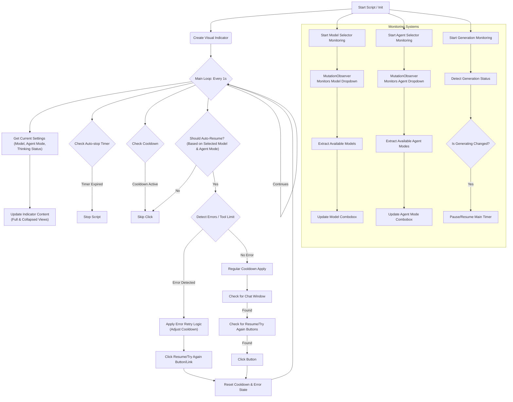
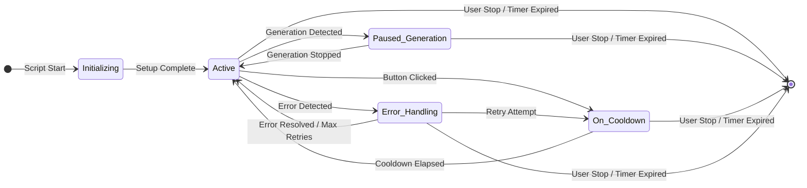
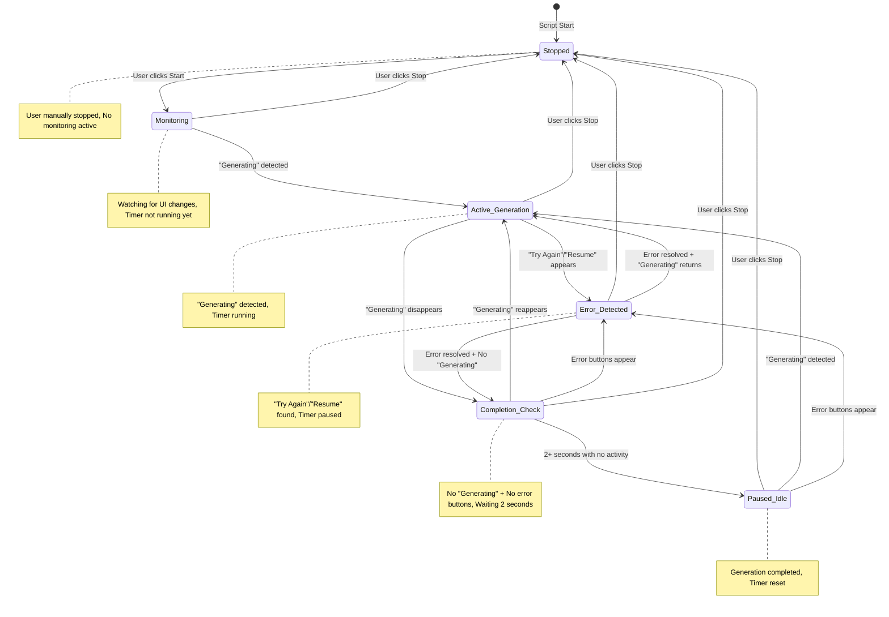

# How Cursor Auto Resume Script Works

This document explains the functionality and a high-level overview of the Cursor Auto Resume (CAR) script using a Mermaid diagram.

## Overview

The Cursor Auto Resume script is an advanced automation tool designed to enhance the user experience in Cursor by automatically handling common interruptions, such as agent stoppages due to rate limits or errors. It provides a visual interface for real-time monitoring and allows users to define specific conditions for auto-resumption, including model and agent mode selection.

## Script Flow Diagram

## Script State Diagram

This diagram illustrates the different states the Cursor Auto Resume script can be in and the transitions between them.

### State Descriptions

*   **Off**: The script is not running. This is the initial state, or the state after the script has been explicitly stopped by the user or when its auto-stop timer expires.
*   **Initializing**: The script is in the process of starting up. It's setting up the visual indicator, event listeners, MutationObservers, and fetching initial settings.
*   **Active**: This is the primary operational state. The script is constantly monitoring the Cursor UI for agent activity, errors, and relevant buttons/links, and is ready to act based on its configuration.
*   **Paused_Generation**: While in the `Active` state, if the script detects that the AI is actively generating a response, it transitions to this state. In `Paused_Generation`, the auto-stop timer is paused to ensure it only counts down during periods of inactivity.
*   **On_Cooldown**: After the script performs an action (e.g., clicking a "Resume" or "Try again" button), it enters this state for a short period. This cooldown prevents the script from spamming the UI with rapid clicks.
*   **Error_Handling**: When a specific error message or scenario is detected (e.g., rate limit, tool limit), the script enters this state. It then applies its retry logic, attempting to click the appropriate button to recover from the error.

## Must Be Like - Enhanced State Diagram

This diagram shows the improved state logic for more accurate generation tracking and timer management.

### Enhanced State Logic Description

**Key Improvements:**

1. **Timer Management:**
   - Timer only runs during `Active_Generation` state
   - Timer pauses during `Error_Detected` state
   - Timer resets when entering `Paused_Idle` state
   - Timer stops completely when user stops script

2. **Generation Tracking:**
   - `Monitoring`: Script watches for changes but timer isn't active yet
   - `Active_Generation`: "Generating" text detected, timer actively counting
   - `Error_Detected`: "Try Again"/"Resume" buttons found, timer paused
   - `Completion_Check`: 2-second verification period to confirm generation ended
   - `Paused_Idle`: Confirmed completion, waiting for next user/AI interaction

3. **State Transitions:**
   - **Start of Generation**: `Monitoring` → `Active_Generation` when "Generating" appears
   - **Error Interruption**: `Active_Generation` → `Error_Detected` when error buttons appear
   - **Error Resolution**: `Error_Detected` → `Active_Generation` when errors cleared and generation resumes
   - **Completion Detection**: Any state → `Completion_Check` when no "Generating" and no error buttons
   - **Confirmed Completion**: `Completion_Check` → `Paused_Idle` after 2+ seconds of inactivity
   - **User Control**: Any state → `Stopped` when user clicks Stop; `Stopped` → `Monitoring` when user clicks Start

4. **Timer Behavior:**
   - **Duration tracks actual interaction time**: from first generation start to final completion
   - **Excludes user thinking time**: timer paused during errors and reset after completion
   - **Prevents infinite running**: auto-stop still applies but only counts active generation periods

## Functional Description

### 1. Core Automation Loop
The script operates on a continuous `setInterval` loop (every 1 second) that performs the following checks:
*   **Current Settings Retrieval**: Dynamically identifies the active AI model (e.g., `gemini-2.5-flash`, `gpt-4.1`), current agent mode (e.g., `Agent`, `Manual`), and whether the model is a "thinking" model (indicated by a 🧠 icon).
*   **Visual Indicator Update**: Updates the draggable and collapsible on-screen indicator with real-time status, timer, model, and agent mode information.
*   **Auto-stop Timer**: Monitors a user-configurable duration (default 30 minutes) after which the script automatically stops to prevent indefinite running.
*   **Cooldown Management**: Implements a cooldown period (default 3 seconds) between auto-resume attempts to avoid spamming the UI. Thinking models receive a slightly longer cooldown.

### 2. Error Handling & Auto-Resumption
The script intelligently detects and responds to various error states:
*   **Pre-defined Error Scenarios**: Uses a list of common error messages (e.g., "rate limit", "We're having trouble connecting to the model provider") and their corresponding recovery button texts ("Try again", "Resume").
*   **Tool Limit Detection**: Specifically identifies messages indicating that the agent has stopped due to exceeding tool call limits (e.g., "stop the agent after 25 tool calls") and clicks the "resume the conversation" link.
*   **Retry Logic**: Implements an exponential backoff strategy for persistent errors, increasing the delay between retry attempts after successive failures.
*   **Universal Button/Link Search**: Employs multiple CSS selectors and text matching to reliably find and click the appropriate resume/try again buttons or links within error popups or chat messages.

### 3. Generation Monitoring
*   **Active Generation Detection**: Continuously checks for the presence of "Generating..." text (or similar indicators) in the UI.
*   **Timer Control**: Automatically pauses the auto-stop timer when the agent is actively generating a response and resumes it once generation is complete, ensuring accurate time tracking.

### 4. Dynamic Model and Agent Mode Selection
*   **Universal Discovery**: Dynamically extracts all available models and agent modes from the Cursor UI by monitoring the respective dropdown selectors. This allows the script to adapt to new or custom models/modes without requiring code changes.
*   **Separate Selection Controls**: Provides independent multi-select dropdowns in the visual indicator for users to specify:
    *   For which **models** auto-resume should be active.
    *   For which **agent modes** auto-resume should be active.
    *   If no items are selected in a list, auto-resume will apply to all available models/modes in that category.
*   **Targeted Resumption**: The script only attempts to auto-resume if the *current active model* **AND** *current active agent mode* are both included in the user's selected preferences.

### 5. Visual User Interface
*   **Draggable & Collapsible Indicator**: A compact, movable overlay in the top-right corner of the screen.
*   **Real-time Status**: Displays the current script status (Running/Stopped), generation status, active model, and agent mode.
*   **Interactive Controls**:
    *   **Stop/Continue**: Toggles script execution.
    *   **Exit**: Fully stops and removes the script from the page.
    *   **Refresh Modes**: Manually updates the list of available models and agent modes.
    *   **Duration Selector**: Allows users to set an auto-stop timer.
*   **Collapsed Mode Display**: When collapsed, the indicator provides essential information (CAR: | 🤖 Mode | 📱 Model | ⏱️ Time | 🔄 Status) in a concise format.
*   **Custom Logging**: An integrated, collapsible log display within the indicator shows script activities, detected errors, and user actions, replacing console interception with a dedicated `scriptLog()` function.

### 6. Robustness & Compatibility
*   **Instance Control**: Prevents multiple instances of the script from running simultaneously.
*   **Cleanup**: Ensures proper removal of UI elements, event listeners, and global references upon script exit to prevent memory leaks.
*   **CSP Compliance**: Uses safe DOM manipulation techniques (e.g., `document.createElement`, `appendChild`, `textContent`) to avoid `innerHTML` issues and comply with Content Security Policies.

This comprehensive approach ensures that the Cursor Auto Resume script is adaptable, user-friendly, and resilient in handling various operational scenarios.